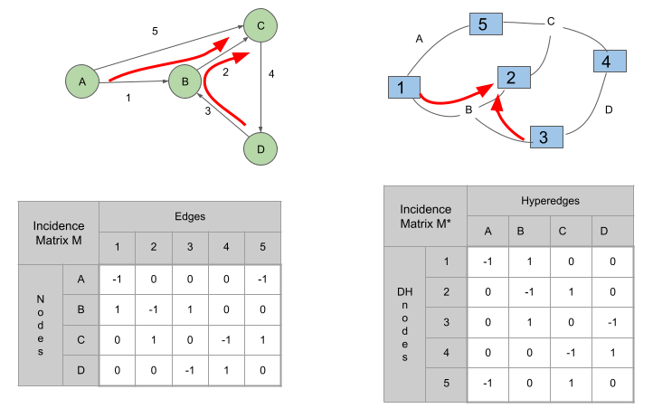

# Path Inference with Dual Hypergraph Features

This work proposes a novel approach for path inference by improving upon the 
[GRETEL model](https://github.com/jbcdnr/gretel-path-extrapolation) 
using a dual hypergraph for feature extraction. By utilizing the 
[Dual Hypergraph Transformation (DHT)](https://github.com/harryjo97/EHGNN), 
the structural role of nodes and edges is interchanged, resulting in more descriptive features 
that enable the capture of more complex relationships among data. 
This approach is applied to two problems: Wikipedia data and GPS navigation data.



## Wikipedia

Implementation of the paper [Dual Hypergraph Features for Path Inference in Wikipedia Links]().

In the Wikipedia data, a graph is constructed where articles are nodes 
and the links between articles are edges. 
The most informative features are extracted from the nodes and edges of the graph,
incorporating the article categories and centrality indicators such as the eigenvector and page-rank centrality. 
Including the semantic information of the article's content the performance of the model is improved.


The Dual Hypergraph structure allows the the extraction of new features. 
Using the similarity of the incidence vectors and the in/out-degree of dual hypergraph nodes 
from a directed version of the hypergraph it is shown that the new features leading to 
an improvement in the performance of GRETEL.


## Navigation data

The features extracted from the Dual Hypergraph are applied to GPS navigation data. 
Additionally, a second-order optimizer, AdaHessian, is employed to further enhance the performance of GRETEL model. 
Experiments in three different datasets - Laussane, Geolife, iWet - show that the use of hypergraph features 
and AdaHessian optimizer contribute to a significant improvement in performance. 

The pre-processing of the navigation data is by Ioannis Tsingalis and can be found here: <br>
[Map Matching for Gretel Algorithm](https://github.com/iTsingalis/gretel_map_matching)

## Reproductibility

All the dependencies are in `requirements.txt` and `environment.yml` files.
You can use them as:
- `pip install -r requirements.txt`
- `conda env create -f environment.yml`

We recommend to create a conda environment using the `.yml` file for higher protection of your system.

You can format your own data following the format defined in `main.py:load_data()` documentation.

### Directory structure

```
├── gretel
|   ├── config
|        ├── gps_nll
|        ├── gps_target
|        ├── wiki_nll
|        ├── wiki_target
|   ├── AdaHessian.py
|   ├── config.py
|   ├── ...
├── workspace
|   ├── chkpt
|        ├── gps-target
|        └── wikispeedia-target
|   ├── gps
|        └── geolife
|        └── iWet
|        └── laussane
|   ├── wikispeedia
|        └── fastText
|        └── plaintext_articles
|        └── raw_input_data
|        └── edges.txt
|        └── edges_nof_fasttextbody.txt
|        └── ...
├── environment.yml
├── README.md
├── requirements.txt
```

- `gretel/config`: includes the configuration for each experiment. `wiki_target` and `gps_target` are used 
- `workspace/chkpt/...` : the results of the experiments will be saved in this directory
- `workspace/gps/...`   : gps navigation data
- `workspace/wikispeedia/...` : wikispeedia data
    - `workspace/wikispeedia/fastText` : download the pretrained model from https://fasttext.cc/docs/en/crawl-vectors.html
    and save it under this directory
    - `workspace/wikispeedia/raw_input_data` : data from http://snap.stanford.edu/data/wikispeedia.html


### Run

##### Wikipedia
In the `gretel/config/wiki_target` file set:
- `experiment_name` 
- `edge_filename` - the available options are:
    - `edges.txt`
    - `edges_nof_fasttextbody.txt`
    - `edges_only.txt`
    - `edges_original_3categories.txt`
    - `edges_original_category1.txt`
    - `edges_original_category2.txt`
    - `edges_original_category3.txt`
    - `edges_original_centrality.txt`
    - `edges_original_fasttextbody.txt`
    - `edges_original_onehot.txt`
    - `edges_original_page_rank.txt`
    - `edges_original_hyperedge_in_out_degree.txt`
    - `edges_original_hyperedge_similarity.txt`
    - `edges_original_hyperedge_similarity_in_out_degree.txt`

```bash
python main.py config/wiki_target
```

You can load the data with the corresponding features:
```bash
# load nodes features
with open(os.path.join(input_dir, 'original_hyper_node_features.pickle'), 'rb') as f:
    nodes_features = pickle.load(f)

# load edge features
with open(os.path.join(input_dir, 'original_hyper_edge_features.pickle'), 'rb') as f:   
    edge_features = pickle.load(f)
```

##### GPS navigation
In the `gretel/config/gps_target` file set:
- `experiment_name` 
- `input_directory` - the available options are:
    - geolife
    - iWet
    - laussane
- `edge_filename` - the available options are:
    - `{input_directory}_hyperedge_similarity.txt`
    - `{input_directory}_hyperedge_DNnode_in_out_degree.txt`
    - `{input_directory}_hyperedge_similarity_DNnode_in_out_degree.txt`


You can load the data with the corresponding features:
```bash
# load nodes features
with open(os.path.join(input_dir, '{input_directory}_hyper_node_features.pickle'), 'rb') as f:
    nodes_features = pickle.load(f)

# load edge features
with open(os.path.join(input_dir, '{input_directory}_hyper_edge_features.pickle'), 'rb') as f:   
    edge_features = pickle.load(f)
```


## Acknowledgment

- Gretel - Extrapolating paths with graph neural networks: [[code]](https://github.com/jbcdnr/gretel-path-extrapolation)- 
[[paper]](https://arxiv.org/abs/1903.07518)
- Edge Representation Learning with Hypergraphs: [[code]](https://github.com/harryjo97/EHGNN) - 
[[paper]](https://arxiv.org/abs/2106.15845)
- Fast Map Matching: [[code]](https://github.com/cyang-kth/fmm) - 
[[paper]](https://www.researchgate.net/publication/321031746_Fast_map_matching_an_algorithm_integrating_hidden_Markov_model_with_precomputation)
